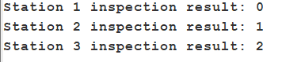

# Assembly Line Stack Simulation

## Overview
This Java program implements a basic **array-based** stack to track inspection states of an automobile as it passes through three stations.  
- We **push** three values (2, 1, 0) onto the stack before any inspection.  
- At each station we **pop** one value and print it with `System.out.println(...)`.

This satisfies:
- Push and pop methods  
- Exactly three pushes and three pops with console output  
- Array-based stack implementation  
- Code can be loaded and run in **Jeliot**

---

## Files
- **AssemblyLineSimulation.java** – contains both the `IntStack` class and the `main()` driver.

---

## Sample Output




---

## Operation Description

1. **Initialization**  
   - Create `IntStack stack = new IntStack(3);` with capacity for three items.

2. **Push Phase**  
   - `stack.push(2);`  
   - `stack.push(1);`  
   - `stack.push(0);`  

3. **Pop Phase (Stations 1–3)**  
   - Each `pop()` removes the top element and prints  
   - Station 1 prints `0`, Station 2 prints `1`, Station 3 prints `2`.

4. **Termination**  
   - After three pops, the stack is empty and the program exits.

---

## Asymptotic Analysis

Let \(n\) be the number of stack operations:

- **Push**: stores one element at the next index → **O(1)**  
- **Pop**: retrieves and removes top element → **O(1)**  

Since we perform a fixed number of operations (3 pushes + 3 pops), the overall runtime is **O(1)** for any fixed-sized stack.  
In general, a sequence of \(m\) pushes and pops runs in **O(m)** time.  
Memory usage is **O(k)** where \(k\) is the stack capacity (here \(k=3\)).

---

## How to Run and Animate in Jeliot

> ⚠️ Jeliot must be installed (v3.1 or later). You can download it from [https://cs.joensuu.fi/jeliot/](https://cs.joensuu.fi/jeliot/)

### Step-by-Step Instructions:

1. **Launch Jeliot 3**  
   - Open the Jeliot application.

2. **Open the Java File**  
   - Go to `File` → `Open`  
   - Browse and select `AssemblyLineSimulation.java`

3. **Check Code Structure**  
   - Make sure that **both** `IntStack` and `AssemblyLineSimulation` are in the **same file** (as they are in this repo).  
   - If not, copy both class definitions into a single `.java` file.

4. **Run the Simulation**  
   - Click the green **Run** button or choose `Run → Animate` from the menu.  
   - The animation window will open, showing how variables and the stack change step by step.

5. **Watch Stack Operations**  
   - Use the control buttons (Step, Run, Pause) to follow:  
     - `push(2)` → stack has [2]  
     - `push(1)` → stack has [2,1]  
     - `push(0)` → stack has [2,1,0]  
     - Then observe the `pop()` sequence and printed outputs.

6. **View Output**  
   - Console/log window in Jeliot will show:
     ```
     Station 1 inspection result: 0
     Station 2 inspection result: 1
     Station 3 inspection result: 2
     ```

---

## Optional (Manual Compilation)

To compile and run from a terminal:
```bash
javac AssemblyLineSimulation.java
java AssemblyLineSimulation
